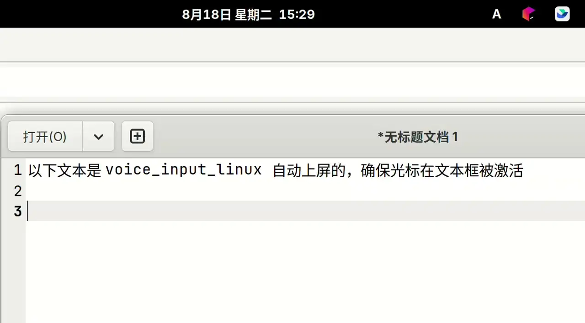

# Qwen-Audio 语音输入

> 按快捷键，说话，说完自动识别并上屏 —— 基于 Qwen-Audio 3.0 流式语音识别（ASR）的 Linux 语音输入工具。

我绑定的快捷键是 Alt+Z


纯本地脚本，不上传录音文件（音频以 Base64 直传 API），识别文本后自动粘贴到当前光标处。支持 Wayland 与 X11、主流发行版与桌面环境。

## 功能特性

- 一键录音：按快捷键开始录音，说完静音自动结束、识别并上屏
- 手动停止：录音中再按一次快捷键立即结束并识别
- VAD 静音检测：按音量阈值判断说话是否结束，不打断长句
- 多后端兼容：自动探测 Wayland/X11，自动选择可用的剪贴板与上屏工具
- 可配置：API Key、输入方式、静音时长、音量阈值、最长录音、日志开关
- 隐私友好：仅把当前一段语音发给 API，不保存任何本地历史
- 一键安装：`setup.sh` 自动识别发行版并装好全部依赖

## demo 演示



## 工作原理

```
  ┌─────────┐  快捷键   ┌──────────────┐   派生   ┌──────────────────┐
  │ 主进程   │ ───────▶ │  start_recording │ ─────▶ │  --listen 子进程   │
  └─────────┘           └──────────────┘          └────────┬─────────┘
       ▲  再按一次(手动停止)                                  │ PortAudio 录音
       └───────────── touch stop 文件 ◀────────────────────┼──┘
                                                           ▼
                                              静音≥2s / 手动 / 超时
                                                           │
                                                           ▼
                                       ┌────────────────────────────┐
                                       │  Base64 → DashScope ASR API │
                                       └────────────────────────────┘
                                                           │ output.text
                                                           ▼
                                       ┌────────────────────────────┐
                                       │  剪贴板 + 模拟 Ctrl+V 上屏   │
                                       │  (wl-copy/xclip  + ydotool/ │
                                       │   wtype/xdotool)           │
                                       └────────────────────────────┘
```

`--listen` 子进程由 `sys.executable` 派生，因此只要入口是 `.venv/bin/python`，整个链路都使用虚拟环境里的依赖，与系统 Python 无关。

## 快速开始

先探测环境（只读检测，推荐先跑）：

```bash
git clone https://github.com/hellodk34/voice_input_linux
cd voice_input_linux
./detect.sh        # 检测发行版/桌面/显示服务器，给出安装建议
```

### 一键安装

```bash
./setup.sh
```

`setup.sh` 会：

1. 检测发行版（`/etc/os-release`）与显示服务器
2. 安装对应系统包（PortAudio、libnotify、剪贴板/上屏工具）
3. 创建 `.venv` 并安装 `sounddevice`、`numpy`
4. 环境自检并打印你所在桌面环境的热键设置位置

`setup.sh` 可重复执行：系统包/venv/pip 均已就绪时是幂等操作（系统包已装会跳过，pip 已满足则无事可做），补依赖或想确认环境时随时重跑。`detect.sh` 也会评估上屏能力（`ydotool` + input 组或 `/dev/uinput` ACL 均算可用）。

### 手动安装

<details>
<summary>点击展开</summary>

```bash
# 1. 系统依赖（以 Debian/Ubuntu 为例）
sudo apt install libportaudio2 libnotify-bin wl-clipboard xclip xdotool
# Wayland 下按需：GNOME 需要 ydotool；KDE/Sway 建议 wtype

# 2. Python 依赖（虚拟环境）
python3 -m venv .venv
.venv/bin/pip install --upgrade pip
.venv/bin/pip install sounddevice numpy

# 3. ydotool 额外步骤（GNOME Wayland 需要）
sudo usermod -aG input $USER   # 然后注销重登
sudo systemctl enable --now ydotool
```

</details>

## 配置

申请 API KEY
- 千问AI平台：platform.qianwenai.com  
- 阿里云百炼平台：bailian.console.aliyun.com

配置文件：`~/.config/qwen-voice-input/config.ini`（首次运行自动生成）

```ini
[auth]
api_key =            # 千问AI平台 / 阿里云百炼控制台获取

[general]
type_method = auto   # auto=自动上屏；clipboard=仅复制手动粘贴
log = true           # 日志开关（~/.config/qwen-voice-input/log.txt）
silence_timeout = 2.0   # 静音多少秒后自动结束录音
vad_threshold = 0.01    # 音量阈值（0~1），低于此视为静音
max_duration = 60       # 最长录音秒数
```

| 配置项 | 默认值 | 说明 |
|---|---|---|
| `type_method` | `auto` | `auto` 自动上屏；`clipboard` 只复制文本、手动粘贴 |
| `log` | `true` | 关闭日志可省磁盘/IO，运行中修改需重启生效 |
| `silence_timeout` | `2.0` | 说话间隙短可以调大，等更久才自动结束 |
| `vad_threshold` | `0.01` | 周围安静可调小（更灵敏），有环境音可调大 |
| `max_duration` | `60` | 防止一直有声音导致录音不结束 |

API Key 也可以改用环境变量（优先级高于配置文件）：

```bash
export QWEN_API_KEY=sk-xxxx
```

## 使用

### 配置全局快捷键

命令统一填：

```
<你的路径>/voice_input_linux/.venv/bin/python <你的路径>/voice_input_linux/voice_input.py
```

| 桌面环境 | 设置位置 |
|---|---|
| GNOME | 设置 → 键盘 → 查看及自定义快捷键 → 自定义快捷键 |
| KDE Plasma | 系统设置 → 快捷键 → 自定义快捷键 → 新建 → 命令 |
| XFCE | 设置 → 键盘 → 应用程序快捷键 |
| Cinnamon | 系统设置 → 键盘 → 快捷键 |
| Sway / i3 | `~/.config/sway/config` 或 `~/.config/i3/config`：`bindsym $mod+v exec ...` |

### 日常使用

1. 把光标放到要输入的地方
2. 按一次快捷键 → 通知栏提示"请开始说话……"
3. 开始说话；说完静音 2 秒 → 自动识别并上屏
4. 想提前结束 → 再按一次快捷键

### 命令行

```bash
.venv/bin/python voice_input.py --help                          # 查看参数
.venv/bin/python voice_input.py --file 某段录音.wav              # 直接识别已有音频
.venv/bin/python voice_input.py --api-key sk-xxxx --file a.wav  # 临时指定 Key 测试
```

## 兼容性

### 显示服务器与桌面环境

| 显示服务器 | 桌面环境 | 剪贴板 | 上屏方式 |
|---|---|---|---|
| Wayland | GNOME (Mutter) | `wl-copy` | `ydotool`（uinput，需 input 组权限） |
| Wayland | KDE Plasma / Sway / Hyprland 等 | `wl-copy` | `wtype`（免 root） |
| X11 | GNOME / KDE / XFCE / Cinnamon / i3 等 | `xclip` / `xsel` | `xdotool` |

脚本按以下顺序自动探测与降级：

- 显示服务器：`WAYLAND_DISPLAY` 有值 → Wayland；否则有 `DISPLAY` → X11
- 剪贴板：Wayland 用 `wl-copy`；X11 依次尝试 `xclip` → `xsel`
- 上屏：X11 用 `xdotool key ctrl+v`；Wayland 下非 GNOME 且装有 `wtype` 时优先 `wtype`，否则用 `ydotool`；都不满足则退化为"已复制，请按 Ctrl+V"

关于 input 组：加入 `input` 组只是让当前用户能打开 `/dev/uinput` 的常规做法。如果系统给 `/dev/uinput` 配置了 ACL（如 `setfacl -m u:用户名:rw /dev/uinput`），即使不在 `input` 组也能正常上屏。可用 `getfacl /dev/uinput` 查看。

### 发行版

| 发行版 | 包管理器 |
|---|---|
| Debian / Ubuntu / Mint / Pop!_OS 等 | `apt`，`setup.sh` 自动处理 |
| Fedora / RHEL / Rocky / AlmaLinux | `dnf` |
| Arch / Manjaro / EndeavourOS | `pacman` |
| openSUSE | `zypper` |
| Void | `xbps-install` |
| 其他 | 脚本给出需要手动安装的包列表 |

## 故障排查

| 症状 | 原因 | 解决 |
|---|---|---|
| 一按快捷键就提示缺 sounddevice/numpy | 没走虚拟环境 | 用 `.venv/bin/python` 启动，或重跑 `./setup.sh` |
| 录音不结束 / 一句话未完就结束 | 音量阈值或静音时长不合适 | 调低 `vad_threshold`、调大 `silence_timeout` |
| 识别成功但没上屏 | 缺少上屏工具 | X11 装 `xdotool`；Wayland 装 `ydotool`(GNOME) 或 `wtype`(KDE/Sway) |
| ydotool 没反应 | 用户不在 input 组且无 `/dev/uinput` ACL，或服务未运行 | `sudo usermod -aG input $USER` 后重登，或 `setfacl -m u:$USER:rw /dev/uinput`；`systemctl enable --now ydotool` |
| 没声音 | 默认输入设备不对 | 检查系统录音设置，或用 `pactl list sources short` 确认 |
| 提示未配置 API Key | 配置里是空值 | 编辑 `~/.config/qwen-voice-input/config.ini` 填入 `api_key` |
| 识别结果乱码 | 终端编码问题 | 脚本内部统一 UTF-8，检查你的系统 locale |

## 项目结构

```
.
├── voice_input.py      # 主程序（录音、VAD、ASR、上屏）
├── setup.sh            # 多发行版一键安装脚本
├── detect.sh           # 环境探测脚本（只检测，给出安装建议）
├── README.md
└── LICENSE
```

## License

[MIT](./LICENSE)
